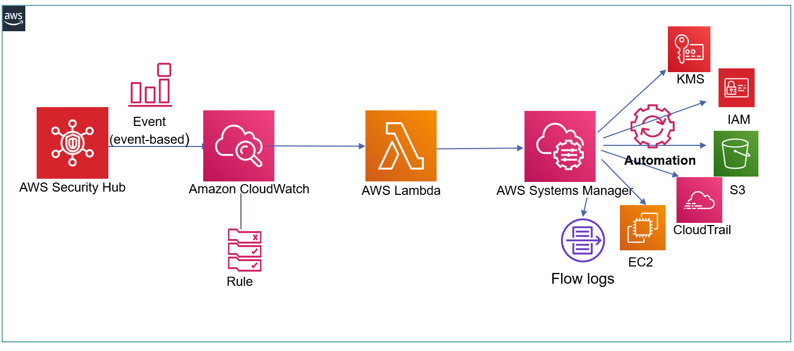

# Automated, Real Time Remediations for PCI-DSS and Foundational Security Best Practice Benchmarks using AWS Security Hub

These templates provide real time and automated remediations for PCI-DSS findings and Foundational Security Benchmark Best Practices (FSBP) by providing a fully automated integration of AWS Security Hub Custom Actions and AWS Systems Manager automation documents.

## How it Works

1. Leverages AWS Security Hub directly to provide automated detection of PCI and FSBP findings
2. Provides NEW AWS Systems Manager Automation Documents for automated remediation for AWS Security Hub PCI and FSBP findings. All documents are automatically provisioned via a AWS CloudFormation template.
3. Provides NEW integration of AWS Security Hub Custom Actions with AWS Systems Manager Automation Documents to provide real time remediations of AWS Security Hub PCI and FSBP findings. Provisions Event based (CloudWatch Events) processing of AWS Security Hub Findings based on the AWS Security Hub Finding Format (ASFF) and packages the finding as input parameters for the associated AWS Systems Manager Automation Document.

## Solution Design

## How To Install - PCI-DSS Remediations

1. **Template 1 of 2:** aws-pci-systemsmanagerautomations.yml
* Provisions AWS Systems Manager automation documents. These documents are used to provide automated remediations within the provisioned AWS Security Hub Action.
* Provisions with fully built-in pre-reqs. No input parameters required. Simply install on the CloudFormation console (or CLI). Installs in approx 3-4 mins.
* Leverages the secure vpc template as a nested template for PCI.Lambda.2 remediation. Create a bucket: s3-vpctemplates-US-REGION and upload the template in this bucket.

2. **Template 2 of 2:** aws-pci-securityhubactions.yml
* Provisions AWS CloudWatch Evemts and AWS Security Hub Custom Actions. No input parameters. Simply install on the CloudFormation console (or CLI). Installs in approx 3-4 mins.
* Leverages the output from the previous template specifically the AWS Systems Manager Automation documents

## How To Install - FSBP Remediations

1. **Template 1 of 2:** aws-fsbp-systemsmanagerautomations.yml
* Provisions AWS Systems Manager automation documents. These documents are used to provide automated remediations within the provisioned AWS Security Hub Action.
* Provisions with fully built-in pre-reqs. No input parameters required. Simply install on the CloudFormation console (or CLI). Installs in approx 3-4 mins.

2. **Template 2 of 2:** aws-fsbp-securityhubactions.yml
* Provisions AWS CloudWatch Evemts and AWS Security Hub Custom Actions. No input parameters. Simply install on the CloudFormation console (or CLI). Installs in approx 3-4 mins.
* Leverages the output from the previous template specifically the AWS Systems Manager Automation documents

## Issues/Support

kmmahaj@amazon.com

