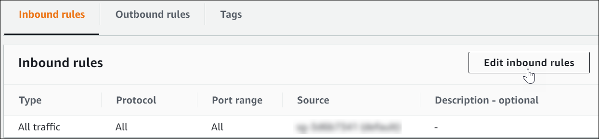
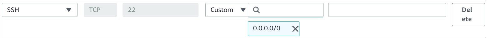

// Add steps as necessary for accessing the software, post-configuration, and testing. Don’t include full usage instructions for your software, but add links to your product documentation for that information.
//Should any sections not be applicable, remove them

== Test the deployment
// If steps are required to test the deployment, add them here. If not, remove the heading
Security Hub begins running security checks within two hours after you deploy PCI DSS and AWS Foundational Security Best Practices controls. After the initial check, subsequent checks occur on a periodic or change-triggered basis, depending on the control. For more information, see https://docs.aws.amazon.com/securityhub/latest/userguide/securityhub-standards-schedule.html[Schedule for running security checks^]. Follow the steps in this section to test the deployment.

The following steps test remediation of the link:#_coverage[PCI EC2.2] control. This control states that the VPC default security group should prohibit inbound and outbound traffic, and it is evaluated on a change-triggered basis. To test it, purposefully misconfigure security group settings in the Amazon EC2 console to allow inbound traffic. This should trigger a Security Hub finding which remediates the security issue by undoing the misconfiguration in the console.

. Choose *Security Groups* in the Amazon EC2 console. 
. Choose the *Security group ID* of the default VPC.
. Choose *Edit inbound rules*.

:xrefstyle: short
[#edit-inbound-rules]
.Edit inbound rules
[link=images/edit-inbound-rules.png]

[start=4]
. Select *Add rule*.
. Select *SSH* as the *Type* and *0.0.0.0/0* as the *Source*.

:xrefstyle: short
[#ssh-rule]
.SSH rule
[link=images/SSH-rule.png]

[start=6]
. Select *Save rules*. Make a note of the security group Amazon Resource Number (ARN).
. In Security Hub, select *Findings*. Locate the finding that corresponds to the misconfiguration.
. Select the check box next to the finding and select *Actions*.
. Select *PCI EC2.2* from the drop-down list. A message displays that findings were successfully sent to AWS CloudWatch Events.
. In Systems Manager, select *Automation*. You should see a successful automation execution that corresponds to the PCI EC2.2 remediation.
. To confirm success of the remediation, select *Security Groups* in the Amazon EC2 console. Then select the *Security group ID* of the default VPC. Confirm that the SSH rule is removed from the *Inbound rules* tab.

TIP: For more information on the format of Security Hub findings, see https://docs.aws.amazon.com/securityhub/latest/userguide/securityhub-standards-results.html[Results of security checks^].

== Best practices for using {partner-product-name} on AWS
AWS categorizes each Security Hub service action into one of five access levels: list, read, write, permissions management, or tagging. To allow a large group of users to access list and read Security Hub actions, and only a small group to access the write action, use managed IAM policies. For more information, see https://docs.aws.amazon.com/IAM/latest/UserGuide/best-practices.html[Security best practices in IAM^].

Security Hub ingests findings generated from integrated providers (both third-party services using https://docs.aws.amazon.com/securityhub/latest/userguide/securityhub-findings-format.html[ASFF^].

== Security
This Quick Start follows security best practices and guidelines as documented in link:https://docs.aws.amazon.com/securityhub/latest/userguide/security.html[Security in AWS Security Hub^].